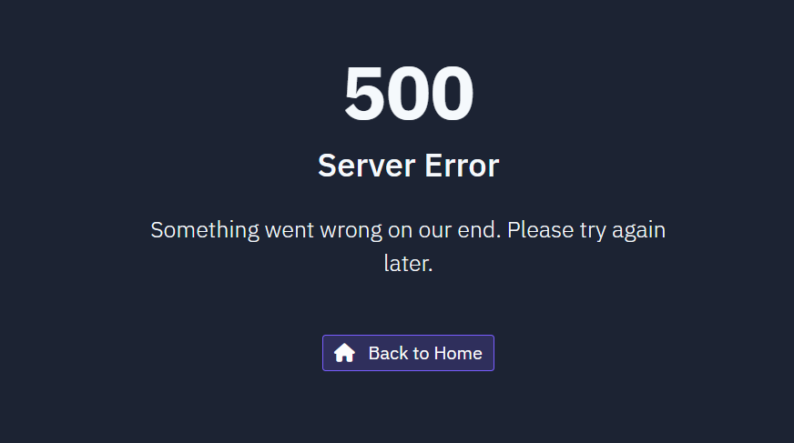
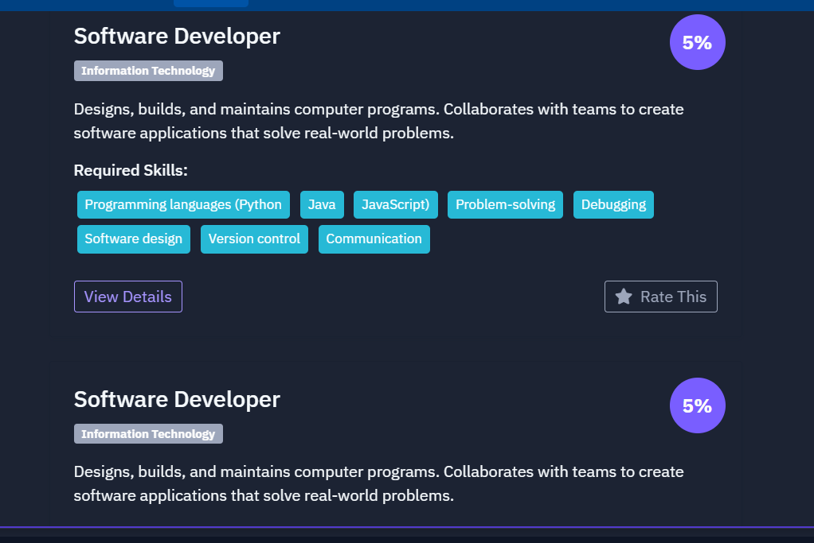

# AI-Based Career Recommendation System

## Project Overview
This is a sophisticated career recommendation system that uses AI and machine learning to match users with career paths based on their skills, interests, education, and experience. The system provides personalized recommendations, career details, and market trends to help users make informed career decisions.

## Key Features
- **Smart Career Matching**: Uses NLP and ML algorithms to match user profiles with suitable career paths
- **Multi-factor Analysis**: Considers skills, interests, education, experience, and market trends
- **Interactive Visualizations**: Charts showing recommendation scores and industry distributions
- **Personalized User Profiles**: Customizable profiles to capture user's unique attributes
- **Market Trend Analysis**: Up-to-date information on career demand and salary ranges
- **Skill Extraction**: Automatic skill identification from freeform text
- **Feedback System**: User-driven feedback mechanism to improve recommendations

## Technical Implementation
- **Backend**: Flask web framework with Python
- **Database**: PostgreSQL with SQLAlchemy ORM
- **ML Engine**: NLTK, scikit-learn, NumPy, pandas
- **Frontend**: Bootstrap, HTML5, CSS3, JavaScript with Chart.js
- **Security**: Flask-Login, Werkzeug password hashing

## Getting Started
See [Setup Guide](setup_guide.md) for detailed instructions on how to set up and run the system.

## Screenshots

## Algorithm Details
The recommendation engine uses a sophisticated matching algorithm:

1. **Semantic Analysis**: TF-IDF vectorization and cosine similarity
2. **Skill Matching**: Advanced keyword recognition with synonym handling
3. **Industry Diversification**: Ensures varied recommendations across industries
4. **Experience Weighting**: Prioritizes recommendations based on user experience
5. **Market Relevance**: Factors in current job market trends

## Data Model
The system uses the following data models:
- User profiles (skills, interests, education, experience)
- Career definitions (required skills, description, industry)
- Recommendations (matching scores, timestamp)
- Market trends (demand levels, salary ranges)
- Feedback (user ratings, comments)

## Future Enhancements
- Integration with job listing APIs
- Learning pathways for career transitions
- Personalized learning resource recommendations
- Community features and career mentor matching